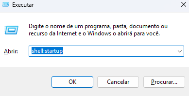
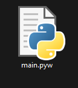

### Dependências

Tenha certeza de ter o [python](https://www.python.org/) instalado em sua máquina

### Instalação do projeto

Clone o projeto no seu computador
```bash
git clone 
```
Instale as dependências necessárias para o projeto rodar
```bash
pip install requirements.txt
```

### Como adicionar os programas

Vá até o arquivo principal **main.py**, e procure a variável `programs` que está logo no topo do código, e adicione o nome do programa e o **caminho até o executável** dele. 

```python
"": {
    "path": r""
},
```

> [!NOTE]
> Não retire o **r** que acompanha o caminho do programa, isso pode ocasionar em *problemas* durante o script.


Caso queira testar o funcionamento do script, rode o seguinte comando no terminal
```bash
py main.py
```

### Executar script ao sistema iniciar

Agora iremos fazer com que o script execute toda vez que o windows iniciar 

1) Aperte `win + r` e digite **shell:startup**



2) Copie e cole o arquivo **main.py** dentro da pasta aberta e altere o formato do arquivo para **.pyw** para que ele possa exeutar sem o console



Se tudo estiver correto, agora o script irá executar toda vez que você iniciar o seu  sistema